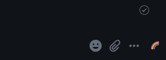

# Gifable Extension

A Firefox extension that allows you to connect with a self-hosted instance of [Gifable](https://github.com/pietvanzoen/gifable), the selfhosted alternative to Giphy or Tenor.

This extension allows you to query your Gifable instance for memes/gifs, and will automatically upload it to a running Element web instance.

## Setup

For now, install this extension as a manual extension.

1. Somewhere in your profile, clone down this repository:

   `git clone https://github.com/AgentScrubbles/gifable-extension`

2. In Firefox, go to `about:debugging` and then "Load Temporary Add-On"
3. Select the `manifest.json` to load the extension.

## Configuration

After installed, go to your extensions and click on the 🌈 for settings.

Add your Gifable URL, and API key.

- The api key can be found under Settings -> API Token in Gifable.

Click Save.

## Usage

In Element (currently the only supported app), you will see a new icon

Clicking it will give the search bar to query your Gifable for images.

Click on any image and you will be prompted to Upload this image to Matrix

Upload and you are finished!

# Future Items/Known Issues

- Currently the only way to close the dialog is to either select an image, or click on the tiny rainbow. I would like to also add the ESC key or clickout outside the dialog.
- Figuring out some way to share credentials for a Gifable instance based on what space you are in
- (Maybe) finding a way to union your Gifable instance with Tenor/Giphy
- Support for other clients
- Query for gifs anywhere on any site and simply display the URL to copy
